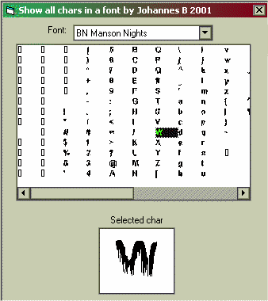



## Show all chars in a font

### Description

This program will show you all chars in a selected font. You can also click on the chars list to zoom
 
### More Info
 

             |
---                |---
**Submitted On**   |1997-05-24 19:35:14
**By**             |[Johannes B](https://github.com/Planet-Source-Code/PSCIndex/blob/master/ByAuthor/johannes-b.md)
**Level**          |Beginner
**User Rating**    |5.0 (15 globes from 3 users)
**Compatibility**  |VB 5\.0, VB 6\.0
**Category**       |[Coding Standards](https://github.com/Planet-Source-Code/PSCIndex/blob/master/ByCategory/coding-standards__1-43.md)
**World**          |[Visual Basic](https://github.com/Planet-Source-Code/PSCIndex/blob/master/ByWorld/visual-basic.md)
**Archive File**   |[Show all c200015242001\.zip](https://github.com/Planet-Source-Code/johannes-b-show-all-chars-in-a-font__1-23403/archive/master.zip)

